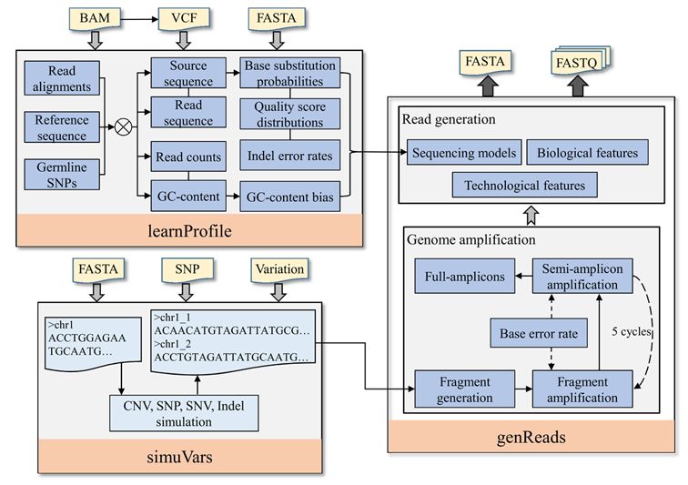

# SCSsim

SCSsim is a tool designed for emulating single-cell genome sequencing data. It consists of three modules: 1) “simuVars” module aims to generate single cell genome from a given reference sequence by inserting user-defined genomic variations into specific genomic loci; 2) “learnProfile” component is developed to infer sequencing platform dependent profiles from real data; 3) “genReads” utility is provided to mimic single-cell genome amplification and read generation procedures based on the results of “simuVars” and “learnProfile”. More details about the software can be found from [here](https://github.com/qasimyu/scssim/tree/master/docs/SCSsim_User_Guide.pdf).



## Requirements

* Linux systems.
* CMake2.8+.
* g++.

## Installation

To build binary, do as follows:

```
tar -zxvf SCSsim.tar.gz
cd SCSsim
cmake .
make
```

After the installation, the main programs of SCSsim are generated in “bin” directory.

## Usage

### Step 1: generate single cell genome sequence

Users can use “simuVars” program to simulate the genome sequence of single cell by defining various genomic variations. The types of variations include single nucleotide polymorphism (SNP), single nucleotide variation (SNV), short insert and deletion (indel), and copy number variation (CNV).

Example:

```
./bin/simuVars -r <reference>.fasta –s /path/to/snp.txt -v /path/to/variation.txt –o /path/to/output.fasta
```

### Step 2: infer sequencing profiles from real datasets

The “learnProfile” utility is designed to infer sequencing profiles from real sequencing data generated from Illumina instruments. In the current version, only three profiles including base substitution probabilities, Phred quality distributions and GC-content bias are measured. Users can build their own profiles from a given real dataset using this utility. 

Examples:

```
./bin/learnProfile -b <sample>.bam -t <targets>.bed -v <sample>.vcf -r <reference>.fasta > <sample>.profile
./bin/learnProfile -b <sample>.bam -v <sample>.vcf -r <reference>.fasta -o <sample>.profile –s /path/to/samtools
```

### Step 3: amplify single cell genome and generate reads

The “genReads” program is developed to simulate single-end or paired-end reads based on the results of “simuVars” and “learnProfile”. Single-cell genome amplification and read generation procedures are implemented in this utility. 

Example:

```
./bin/simuReads -i /path/to/simu.fa -m /path/to/hiseq2500.profile -t 5 -o /path/to/reads
```

## Citation

Please cite SCSsim in your publications if it helps your research:

``` bibtex
@incollection{yu2019scssim,
  author = {Zhenhua Yu, Ao Li},
  title = {SCSsim: simulating single-cell genome se-quencing data},
  year = {2019, under review},
}
```

## Contact

If you have any questions, please contact zhyu@nxu.edu.cn.